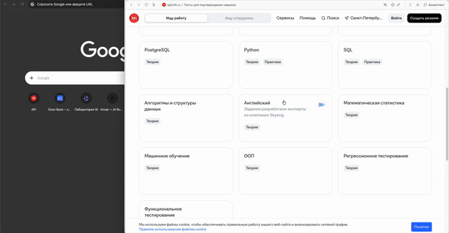

<div align="center">


# AI Browser Agent

### Дай браузеру задачу — он выполнит её сам

Автономный ИИ-агент в реальном Chrome: навигация, формы, авторизация,
анализ страниц — по одной текстовой инструкции. Не песочница и не демо —
работает на настоящих сайтах, включая кросс-origin iframe логина.

[](LICENSE)
[](https://www.python.org/)
[](https://playwright.dev/python/)
[](docs/PROVIDERS.md)
[](https://github.com/BOSSMANIWAY/ai_browser/actions/workflows/ci.yml)

**Бесплатный ИИ «из коробки»:** Perplexity через cookie вашей браузерной сессии —
без API-ключей и оплаты. Нужна стабильность — подключите любой API-вендор одной
переменной окружения.

<a href="demo_ai_brows.mp4">
  
</a>

> ▶ **Нажмите на гифку, чтобы посмотреть полное 4-минутное демо** — [demo_ai_brows.mp4](demo_ai_brows.mp4)
> (воспроизводится прямо на странице GitHub).

</div>

---

## Возможности

| | |
|---|---|
| **Понимает человека** | Запросы с опечатками, вольной формулировкой и без URL — «финансы озон зайди и залогинся» будут поняты |
| **Любые сайты** | Кросс-origin iframe (Ozon ID, VK, Госуслуги), shadow DOM, модалки, маски ввода — агент «видит» всё через единый снимок состояния |
| **Честный цикл** | `observe → decide → act → state_diff → verify → goal_check`: клик «сработал» только если страница реально изменилась, успех решает рантайм, а не фантазия LLM |
| **Не зацикливается** | State-based loop breaker: три повтора одного действия → автоматическое recovery без обращения к модели |
| **Спрашивает, когда надо** | `wait_user` для SMS-кодов, 2FA и капчи: пауза с полем ввода в UI, мгновенное пробуждение от данных пользователя |
| **Помнит ошибки сайта** | Отвергнутые логин/почему не будут повторены: вердикт модели попадает в память и предупреждает в каждом промпте |
| **12 LLM-вендоров** | Perplexity (бесплатно, через cookie), OpenAI, Kimi, DeepSeek, Groq, Mistral, OpenRouter, Gemini, xAI + локальные Ollama / LM Studio / LocalAI. Новый вендор = одна запись в реестре |
| **Vision** | Отправка скриншота страницы в модель — для игровых и визуальных уровней (у vision-провайдеров) |
| **Веб-интерфейс и CLI** | Живой прогресс по WebSocket, выбор модели в UI, `--list-providers` в терминале |
| **Приватность** | Персональные данные — в локальном файле из `.gitignore`; пароли и коды не хранятся; сервер слушает только `127.0.0.1` |

## Быстрый старт

```bash
git clone https://github.com/BOSSMANIWAY/ai_browser.git && cd ai_browser
python3 -m venv ../ai_browser_venv && source ../ai_browser_venv/bin/activate
pip install -r requirements.txt && playwright install chromium
./start.sh                      # → http://127.0.0.1:8765
```

Введите задачу — агент подключит Chrome и начнёт работать.
Хотите свою модель: `cp .env.example .env`, заполните ключ одного провайдера,
`python3 main.py --list-providers` покажет, кто готов. Подробности — [Запуск](#-запуск)
и [docs/PROVIDERS.md](docs/PROVIDERS.md).

## Содержание

- [Возможности](#возможности)
- [Быстрый старт](#быстрый-старт)
- [Архитектура](#архитектура)
- [Компоненты](#компоненты)
- [Цикл агента v2.1](#-цикл-агента-v21)
- [Запуск](#-запуск)
- [Использование](#использование)
- [Действия агента](#действия-агента)
- [Профиль пользователя](#профиль-пользователя)
- [Ожидание данных от пользователя](#-ожидание-данных-от-пользователя)
- [Сессии и память](#сессии-и-память)
- [Веб-интерфейс](#веб-интерфейс)
- [Подключение LLM-вендоров](docs/PROVIDERS.md)
- [Отладка](#отладка)

---

## Архитектура

```
┌─────────────────────────────────────────────────────────────┐
│                    Веб-интерфейс (FastAPI)                   │
│              http://127.0.0.1:8765 + WebSocket               │
└──────────────────────────┬──────────────────────────────────┘
                           │ WebSocket
                           ▼
┌─────────────────────────────────────────────────────────────┐
│                    web_backend.py (тонкий WS-мост)           │
│  - Подключение к Chrome (CDP → fallback persistent profile)  │
│  - Запуск задач агента, прогресс в UI                        │
│  - user_input: передача данных агенту (код из SMS и т.п.)    │
└──────────────────────────┬──────────────────────────────────┘
                           │
                           ▼
┌─────────────────────────────────────────────────────────────┐
│                    Agent Loop v2.1 (agent/loop.py)           │
│  1. OBSERVE — BrowserState (DOM + фреймы + notices)          │
│  2. LOOP BREAKER — state-based анти-луп + recovery           │
│  3. DECIDE — LLM (план + мысль + действие)                   │
│  4. ACT — выполнение через Controller                        │
│  5. OBSERVE + STATE DIFF — изменилось ли состояние реально   │
│  6. VERIFY — progress_verdict + verify_typed_value           │
│  7. GOAL CHECK — объективные сигналы успеха (runtime)        │
│  8. Память отвергнутых данных + сообщения пользователя       │
└────┬──────────────┬──────────────┬───────────────────────────┘
     │              │              │
     ▼              ▼              ▼
┌─────────┐  ┌──────────┐  ┌────────────┐
│ Planner │  │ Memory   │  │ LLM Client │
│ v2      │  │ Цели     │  │ Perplexity │
│ JSON    │  │ История  │  │ Kimi       │
└─────────┘  └──────────┘  └────────────┘
┌─────────────────────────────────────────────────────────────┐
│                  Browser Controller                          │
│              Playwright + Chrome DevTools Protocol            │
│  - connect(mode=auto|attach|launch)                          │
│  - Навигация с детектом ERR_* ошибок                         │
│  - Frame-aware клики/ввод (кросс-origin iframe)              │
│  - wait_for_stable_page                                      │
└──────────────────────────┬──────────────────────────────────┘
                           │
                           ▼
┌─────────────────────────────────────────────────────────────┐
│                      Chrome                                  │
│   CDP :9222 или persistent profile ai_browser_profile/       │
└─────────────────────────────────────────────────────────────┘
```

---

## Компоненты

### `browser/controller.py` — Контроллер браузера
- **connect(mode)**: `auto` (CDP :9222 → fallback), `attach`, `launch` (persistent profile `ai_browser_profile/`, куки сохраняются между сессиями)
- **navigate** возвращает `{ok: False, error: "ERR_NAME_NOT_RESOLVED: url"}` при сетевых ошибках — DNS-ошибка НЕ успех
- **wait_for_stable_page** — ожидание `document.readyState == complete` после навигации
- **Frame-aware действия**: `_frame_for_element` (async) находит фрейм по data-eid; `click_element`, `type_into_element`, `get_element_value` работают с элементами в кросс-origin iframe (Ozon ID, виджеты оплаты, reCAPTCHA)

### `browser/browser_state.py` — BrowserState («глаза» агента)
STATE_JS размечает элементы `data-eid` (e1, e2, ...) и собирает снимок:
- **Интерактивные элементы** — рекурсивный обход shadow DOM (deepQueryAll), атрибуты: tag, type, text, placeholder, value, name, href, form, aria, required, disabled, checked, **in_dialog** (в модальном окне), in_viewport
- **notices** — заметные сообщения БЕЗ фильтра по словам: ARIA-роли (`role=alert/status`, `aria-live`) + **цветной текст** (красные/оранжевые/зелёные оттенки через computed color). Модель получает `{text, color, role}` и сама оценивает семантику — как человек глазами
- **field_context** — контекст полей ввода: маска/placeholder («+7 (___) ___-__-__»), текущее значение («уже введено: +7 (911)»), подпись label, тексты рядом с полем (подсказки, ошибки валидации) с цветом
- **dialog** — открытые модальные окна (dialog, role=dialog, modal/popup классы)
- **headings, page_text, flags** (captcha, cookie_banner, login_form)
- **capture_browser_state** обходит ВСЕ фреймы через Playwright frames API (same-origin policy не мешает); элементы фреймов получают продолжение eid; notices/field_context/dialog из фреймов мержатся в общий снимок

### `agent/state_diff.py` — Diff состояний
«Успешный клик» ≠ «состояние изменилось». Сравнивает: URL, title, элементы (появились/исчезли), inputs/forms delta, dialog, текст, **notices** (появление выделенного сообщения = изменение). `progress_verdict` — вердикт по tool'у. `verify_typed_value` — прогресс type = значение поля установилось (frame-aware).

### `agent/goal_detector.py` — Детектор цели (runtime)
Объективные сигналы успеха, LLM не решает сам:
1. Форма отправлена через GET (query-параметры с данными формы в URL)
2. Сообщение об успехе появилось после действия (сравнение с текстом ДО)
3. Навигация на целевой URL (universal filler-подход: из задачи убираются домены и навигационные слова; остаток содержательного текста = есть действия → авто-финиш НЕ срабатывает). Работает с опечатками.

### `agent/loop.py` — Основной цикл v2.1
- **finish обрабатывается ДО observe** (страница не менялась)
- **LLM retry**: пустой ответ → 3 попытки с backoff → честная остановка
- **Повторный observe через 1.5с** если diff пуст после navigational action (анимации модалок)
- **State-based loop breaker**: ключ (URL + scrollY + первые 15 eid, tool + params); 3× same → recovery БЕЗ LLM (scroll → подсказка якорной ссылки; type → «поле заполнено»; click → другой элемент), лимит 3 recovery → stop
- **Память отвергнутых данных**: LM помечает `rejected_value` в ответе (её вердикт по сообщениям страницы) → рантайм запоминает → предупреждение «ОТВЕРГНУТЫЕ САЙТОМ ДАННЫЕ (НЕ ИСПОЛЬЗОВАТЬ ПОВТОРНО)» в каждом следующем промпте
- **Сообщения пользователя**: `provide_user_input` копит в очередь → блок «СООБЩЕНИЯ ОТ ПОЛЬЗОВАТЕЛЯ» в промпте на следующем шаге
- **fill_form** — композитное действие: скоринг полей (name/id/placeholder/aria), поиск submit-кнопки, отправка

### `agent/planner.py` — Планировщик v2
- Устойчивый парсинг: markdown-обёртки, обрезанный JSON (дополнение скобками), склейка
- TOOL_SYNONYMS: `navigate_to/go_to/open → navigate`, `fill/input/write → type`, `done/complete → finish`, `search → navigate google`, `screenshot → wait`
- Нормализация параметров: `element_id/eid/selector/target → element_id`, текст вместо id → `text_fallback`
- `rejected_value` / `rejected_message` — вердикт LLM об отвергнутых данных
- 10/10 юнит-тестов

### `agent/user_profile.py` — Профиль пользователя
Персональные данные для автозаполнения форм. **Файл в `.gitignore` и не коммитится** —
в репозитории только шаблон `agent/user_profile.example.py`. Скопируй его и подставь
свои: телефон, email(ы), ФИО (кириллица + латиница), никнейм, сайт.

Правила: значение по смыслу поля, латиница для англоязычных форм, недостающие данные (пароль, карта, код из SMS) НЕ выдумываются — wait_user или finish.

### `prompts/system.py` — Промпты
- **Универсальные принципы**: препятствия по приоритету (cookie → модалка → captcha), поиск элементов по тексту/placeholder/aria/type
- **2a. Похожие кнопки**: две кнопки «Войти» различаются по полному тексту, положению, контексту. Кнопка рядом с полем = submit формы; кнопка-опция («Войти по почте») = переключение способа
- **2b. Маски ввода**: если маска «+7» или в поле уже стоит префикс — вводи номер БЕЗ кода страны
- **4a. Память об ошибках**: данные отвергнуты → НИКОГДА не повторять, переключиться на альтернативу (email↔телефон), пометить `rejected_value`
- **4b. Выбор способа входа**: приоритет у неотвергнутых данных; обычная почта/телефон > OAuth (VK ID, Госуслуги)
- **4c. wait_user**: код из SMS/push, 2FA, данные карт, CAPTCHA — только через wait_user, не выдумывать
- **8. Сообщения страницы**: прочитать КАЖДОЕ выделенное сообщение, самому оценить семантику (ошибка/успех/подсказка), реагировать
- **User template**: «ПОНИМАНИЕ ЗАДАЧИ» (смысл, данные по назначению, опечатки по контексту) + «ЧТО ПРОИСХОДИТ НА САЙТЕ» (тип страницы, препятствия, направление, заполненность полей)

### `agent/memory.py`, `agent/llm_client.py`, `web_backend.py`, `main.py`, `start.sh`, `web/index.html` — без изменений в архитектуре

---

##  Цикл агента v2.1

```
while running and step < max_steps:
    state = observe()                          # 1. OBSERVE (все фреймы)
    if stuck(state): recovery()                # 2. LOOP BREAKER
    action = llm_decide(state,                 # 3. DECIDE
                        + rejected_warning     #     память отвергнутых
                        + user_messages)       #     сообщения пользователя
    result = execute(action)                   # 4. ACT
    if action == finish: break                 # 9. Завершение
    state_after = observe(wait_stable)         # 5. OBSERVE
    diff = diff_states(state, state_after)     # 5.5 STATE DIFF (+1.5с retry)
    verdict = progress_verdict(diff, action)   # 6. VERIFY
    if tool == type: verify_typed_value()      #    прогресс = value поля
    if goal_detected(): break                  # 7. GOAL CHECK (runtime)
    last_result = format(result, verdict,      # 8. Контекст для след. шага
                         notices_appeared)
```

---

## 🚀 Запуск

### 1. Подготовка Chrome

Chrome запускается автоматически (persistent profile). Ручной вариант:

```bash
"/Applications/Google Chrome.app/Contents/MacOS/Google Chrome" \
    --remote-debugging-port=9222 \
    --no-first-run \
    --no-default-browser-check
```

### 2. Установка зависимостей

```bash
cd ai_browser
python3 -m venv ../ai_browser_venv
source ../ai_browser_venv/bin/activate
pip install -r requirements.txt
playwright install chromium
```

### 3. Настройка LLM

Провайдеры подключаются через единый реестр `agent/providers.py` — цикл агента,
веб-интерфейс и CLI не содержат списков вендоров. Поддерживается 12 из коробки:
**Perplexity** (по умолчанию), OpenAI, Kimi, DeepSeek, Groq, Mistral, OpenRouter,
Gemini, xAI и локальные **Ollama / LM Studio / LocalAI**.

Быстрый старт:

```bash
cp .env.example .env          # заполните только свой провайдер
set -a; source .env; set +a
python3 main.py --list-providers            # кто есть и где какого ключа не хватает
python3 main.py --provider deepseek --task "..."
```

Два способа подключить модель:

**1. Бесплатно — Perplexity через браузер (по умолчанию).** Официального API у
Perplexity нет, поэтому агент использует вашу авторизованную сессию: запрос
идёт на тот же эндпоинт, что и сайт, — `POST /rest/sse/perplexity_ask`.
Нужно один раз скопировать cookie из DevTools:

1. Войдите на https://www.perplexity.ai и задайте любой вопрос.
2. `F12` → вкладка **Network** → найдите запрос `perplexity_ask`.
3. Из **Request Headers** скопируйте значение заголовка `Cookie` (одной строкой,
   обязательно с httpOnly-куками `__Secure-1PSID`, `__Secure-1PSIDTS`).
4. Сохраните в `.pplx_cookies.txt` в корне проекта (файл в `.gitignore`) или
   укажите путь `export PPLX_COOKIES_FILE=/path/to/file`.

Модель по умолчанию — `claude47opus`. По мере истечения сессии `HTTP 403` —
повторите шаги 1–4. Пошагово и с поиском неполадок:
[docs/PROVIDERS.md](docs/PROVIDERS.md).

**2. Платно — вендоры с API-ключом** (стабильнее, не зависят от cookie и
лимитов аккаунта). Достаточно экспортировать ключ:

- **Kimi:** `export KIMI_API_KEY="sk-..."`; для международного ключа
  `export KIMI_BASE_URL=https://api.moonshot.ai/v1` (по умолчанию включён китайский `.cn`)
- **Ollama:** бесплатно и локально — `ollama serve` + `ollama pull qwen3:32b`
  (vision: `ollama pull qwen3-vl:8b`)
- **OpenAI:** `export OPENAI_API_KEY="sk-..."`
- **DeepSeek / Groq / Mistral / OpenRouter / Gemini / xAI:** аналогично, свои
  переменные (`DEEPSEEK_API_KEY`, `GROQ_API_KEY`, ...); **LM Studio / LocalAI** —
  локальные серверы, ключ не нужен.

Эндпоинт любого провайдера меняется переменной `<КЛЮЧ>_BASE_URL` без правки кода;
веб-селекторы и список моделей подхватывают реестр автоматически через
`GET /api/providers`. Подробнее — [docs/PROVIDERS.md](docs/PROVIDERS.md).

### 4. Запуск

```bash
cd ai_browser
./start.sh
```

Веб-интерфейс: **http://127.0.0.1:8765**. Для полной остановки: **два Ctrl+C**.

---

## Использование

1. Откройте http://127.0.0.1:8765 → **«Подключиться»**
2. Введите задачу: `"пройди тест на site.ru"`, `"Открой example.com и заполни форму обратной связи"`
3. Наблюдайте прогресс: план → мысль → действие → результат на каждом шаге

### Передача данных агенту (код из SMS и т.п.)

Во время работы агента внизу чата доступно поле **«Код из SMS / данные для агента»**:
- Если агент в режиме `wait_user` — данные пробуждают его мгновенно
- Если агент работает — данные попадут в контекст модели на следующем шаге
- Альтернатива: введите код прямо в браузер — агент заметит изменение страницы за 2-4 секунды (поллинг во время ожидания) и продолжит с новым состоянием

---

## Действия агента

| Действие | Описание | Параметры |
|----------|----------|-----------|
| `navigate` | Переход по URL (ERR_* = ошибка) | `url` |
| `click` | Клик по element_id (frame-aware) | `element_id` |
| `type` | Ввод текста (frame-aware, verify value) | `element_id`, `text`, `clear`, `submit` |
| `fill_form` | Композитное: заполнить поля + submit | `fields`, `form_id`, `submit` |
| `key` | Нажатие клавиши | `key` |
| `scroll` | Прокрутка | `direction`, `amount` |
| `select` | Выбор опции | `element_id`, `value` |
| `new_tab` / `switch_tab` / `close_tab` | Вкладки | `url` / `tab_id` |
| `extract` | Извлечение текста | `selector` |
| `wait` | Ожидание (max 10с) | `seconds` |
| `wait_user` | **Пауза до данных от пользователя** (SMS-код, 2FA, пароль) | `reason`, `timeout` |
| `evaluate` | JS (fallback, не основной механизм) | `expression` |
| `finish` | Завершение с отчётом | `reason` |

### Формат ответа LLM

```json
{
  "plan": ["подзадача 1", "подзадача 2"],
  "thought": "что вижу, что делаю, почему",
  "action": {"tool": "click", "element_id": "e17"},
  "rejected_value": "значение, отвергнутое сайтом (опционально)"
}
```

**Правило eid:** id (e1..eN) перенумеровываются при каждом observe — использовать только id из текущего состояния.

---

## Профиль пользователя

См. `agent/user_profile.py`. Данные подставляются в промпт автоматически. Файл в `.gitignore`.

**Рекомендации по расширению:** адрес доставки, дата рождения — можно добавить; пароли и карты — не хранить в открытом виде (вводить через wait_user или вручную).

---

## ⏸ Ожидание данных от пользователя

Действия, которые агент не может выполнить сам (код из SMS, push, 2FA, CAPTCHA):

1. Модель вызывает `wait_user` с reason
2. Цикл ставится на паузу (asyncio.Event, таймаут 5 мин)
3. В UI появляется поле ввода
4. Три пути продолжения:
   - **Передать через UI** → мгновенное пробуждение, данные в результат
   - **Ввести в браузер самому** → поллинг заметит изменение за 2-4с
   - **Таймаут** → если страница изменилась, агент продолжит с новым состоянием; иначе честная остановка

---

## Сессии и память

```
ai_browser_sessions/<timestamp>/
├── memory.json          # Цели, действия, контекст
└── history.json         # Полная история шагов
```

---

## Веб-интерфейс

### WebSocket-сообщения

**От клиента:**
```json
{"action": "connect"}
{"action": "task", "payload": {"prompt": "...", "provider": "pplx", "model": "claude47opus"}}
{"action": "user_input", "payload": {"value": "482913"}}
{"action": "tabs"} / {"action": "navigate", ...} / {"action": "disconnect"}
```

**От сервера:**
```json
{"type": "connected", "tabs": [...]}
{"type": "task_start", "task_id": "...", "prompt": "..."}
{"type": "progress", "task_id": "...", "text": "[STEP] Шаг 1: navigate |  ... |  ..."}
{"type": "task_complete", "task_id": "...", "reason": "..."}
{"type": "task_end", "task_id": "..."}
```

---

## Тестирование

```bash
source ../ai_browser_venv/bin/activate

# Синтаксис всего дерева
python3 -m compileall -q .

# STATE_JS через node
python3 -c "
import subprocess
from browser.browser_state import STATE_JS
r = subprocess.run(['node', '--check', '/dev/stdin'], input='(' + STATE_JS + ')', capture_output=True, text=True)
print('OK' if r.returncode == 0 else r.stderr)
"

# Импорт всего приложения
python3 -c "from web_backend import app"

# Тесты-скрипты (без браузера и сети): логика модалок, анти-луп, парсер
PYTHONPATH=. python3 tests/test_dialog_logic.py
```

CI (`.github/workflows/ci.yml`) прогоняет эти же проверки на каждом push/PR.
Остальные скрипты в `tests/` требуют запущенного Chrome или ключей вендоров —
они не входят в CI.

---

## Отладка

### Известные решения (история багов)

| Баг | Фикс |
|-----|------|
| `_frame_for_element` синхронный вызывал async `frame.evaluate` → RuntimeWarning, фреймы не находились | Метод стал async, все вызовы с `await` |
| Преждевременный finish при «залогинся» | Universal filler-подход в GoalDetector |
| navigate DNS-ошибка возвращала успех | `{ok: False, error: "ERR_*: url"}` |
| Невидимая форма логина (кросс-origin iframe) | Frame-aware snapshot/click/type/get_element_value |
| Ложный NO_PROGRESS на type | `verify_typed_value` (прогресс = value поля) |
| LM кликала несуществующий e1 (eid перенумеровались) | Правило «только id из текущего состояния» в промпте |
| Модель не видела ошибку «не можем найти аккаунт» | notices (ARIA + цветной текст) + field_context, мерж из фреймов |
| Модель повторяла отвергнутый email | rejected_value (вердикт LLM) + предупреждение в промпте |
| Модель вводила 8 в поле с маской +7 | field_context показывает маску и текущее значение; правило 2b |
| Модель путала кнопки «Войти» / «Войти по почте» | in_dialog метка; правило 2a (кнопка рядом с полем = submit) |
| Агент не замечал, что пользователь сам ввёл код | Поллинг состояния во время wait_user (каждые 2с) |

### Частые проблемы

**Chrome не подключается:** `curl http://localhost:9222/json/version` — при ошибке агент сам запустит Chrome с persistent profile.

**LLM возвращает пустой ответ:** retry ×3 с backoff уже встроен; проверьте cookies Perplexity.

**Агент зациклился:** state-based loop breaker делает recovery после 3 повторов; максимум 3 recovery → остановка.

---

## Структура проекта

```
ai_browser/
├── main.py                    # Точка входа
├── web_backend.py             # FastAPI + WebSocket (тонкий мост)
├── start.sh                   # Скрипт запуска
├── requirements.txt
├── README.md
│
├── browser/
│   ├── controller.py          # Playwright: connect, navigate, frame-aware действия
│   ├── browser_state.py       # STATE_JS + BrowserState + capture (фреймы, notices)
│   ├── screenshot.py          # (legacy, импортируется web_backend)
│   ├── tab_manager.py         # (legacy, импортируется web_backend)
│   └── agent_overlay.py       # (legacy, импортируется web_backend)
│
├── agent/
│   ├── loop.py                # Цикл v2.1: observe→decide→act→diff→verify→goal
│   ├── planner.py             # LLM-планировщик v2 (устойчивый парсинг)
│   ├── state_diff.py          # Diff состояний + progress_verdict
│   ├── goal_detector.py       # Runtime-детектор цели
│   ├── user_profile.py        # Персональные данные (.gitignore!)
│   ├── memory.py              # Память агента
│   ├── providers.py           # Реестр LLM-вендоров (модели, эндпоинты, ключи)
│   └── llm_client.py          # Транспорты: OpenAI-совместимый / Ollama / Perplexity
│
├── prompts/
│   └── system.py              # Системный промпт + user template
│
├── web/
│   └── index.html             # Веб-интерфейс (поле user_input)
│
├── ai_browser_profile/        # Persistent Chrome профиль (.gitignore)
└── ai_browser_sessions/       # Сессии и память
```

---

## 🔒 Безопасность

- `agent/user_profile.py` и `ai_browser_profile/` в `.gitignore` — персональные данные не коммитятся
- Пароли и коды не хранятся — передаются через wait_user в момент необходимости
- API-ключи и cookie-сессии читаются только из окружения/локальных файлов, в репозиторий не попадают (`.env`, `.pplx_cookies.txt` в `.gitignore`)
- `/api/providers` отдаёт лишь факт наличия ключа, никогда — сам ключ
- WebSocket только на `127.0.0.1`
- Chrome с изолированным persistent profile

Нашли уязвимость? Сообщите приватно — см. [SECURITY.md](SECURITY.md).

---

## 🗺 Roadmap

- [x] Единый реестр LLM-вендоров + OpenAI-совместимый транспорт + vision
- [x] Бесплатный путь: Perplexity через cookie браузерной сессии
- [x] Веб-UI с выбором провайдера/модели из API (`GET /api/providers`)
- [ ] Параллельные вкладки/подзадачи в одном прогоне
- [ ] Скачивание файлов и работа с диалогами ОС
- [ ] Плагин-система действий поверх реестра провайдеров
- [ ] Экспорт сессий в переиспользуемые «рецепты» задач

Предложения — в [Issues](https://github.com/BOSSMANIWAY/ai_browser/issues).

---

## 🤝 Участие

Приветствуются PR: новые провайдеры в реестр, фиксы цикла агента, документы.
Гайд — [CONTRIBUTING.md](CONTRIBUTING.md).

## 📄 Лицензия

MIT — см. [LICENSE](LICENSE).
